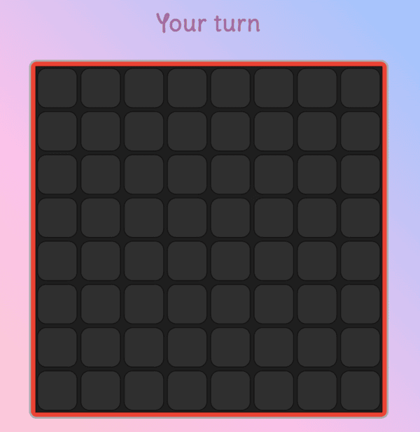

# Color Wars
## Overview
Color Wars is a 1v1 turn-based board game where strategy and chain reactions determine the winner. Claim your territory, strategically place your tiles, and eliminate your opponent!

## Current Version
**Status:** Work in Progress
**Players:** 2 (Automatically Matched)

## Game Link
[Play Color Wars on Render](https://miryarik.github.io/color-wars/)

## How to Play
### Accessing the Game
1. Open the game link
   - Both players go to the game link.
   

2. Wait for auto-matching
   - Once joined, the two players get matched automatically.
   

3. Game begins
   - The header will indicate when you are ready to play your turn
   

4. Have fun
   - May the better player win!
   

### Game Rules.
- Players take turns placing tiles.
- Each player has a unique color.
- Each player can place a tile with 3 dots anywhere on the board in their first turn.
- In their subsequent turns, players can only play on tiles of their color already present on the board.
- Create chain reactions to expand your territory.
- **Objective:** Eliminate opponent by removing all of their tiles.

### Winning the Game
- If a player has no tiles of their color remaining, they lose.
- The other player wins.

## Gameplay Mechanics
- Turn-based gameplay
- Automatic tile elimination through chain reactions
- Strategic tile placement is key to victory

## Current Limitations
- Only 2 players supported
- Server hosted on Render
- Minimal UI
- Basic game logic implemented

## Future Roadmap
- Support for more than 2 players
- Enhanced UI
- Improved matchmaking

## Contributing
Interested in improving Color Wars? Contributions are welcome! 
- Fork the repository
- Create a feature branch
- Submit a pull request

## Screenshots

